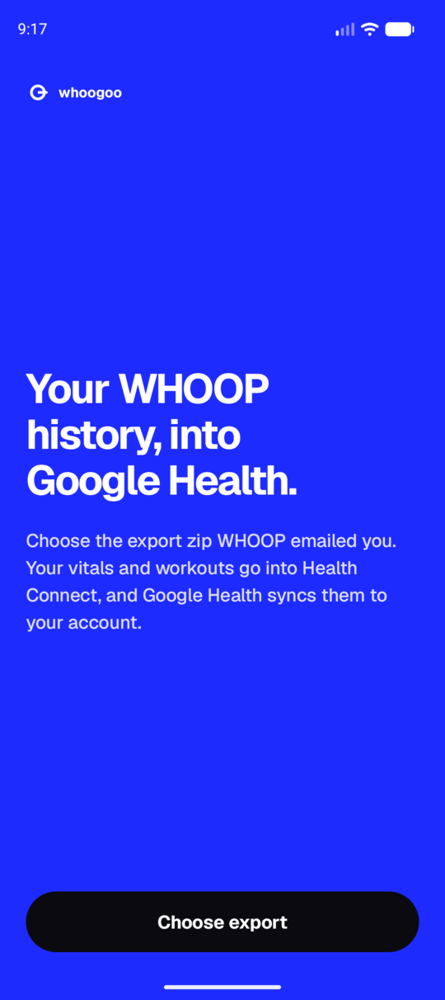
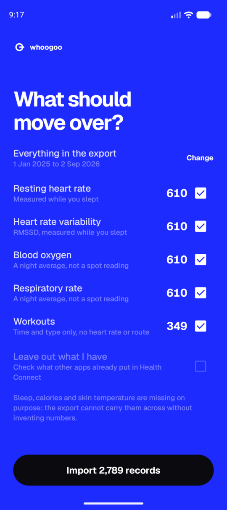
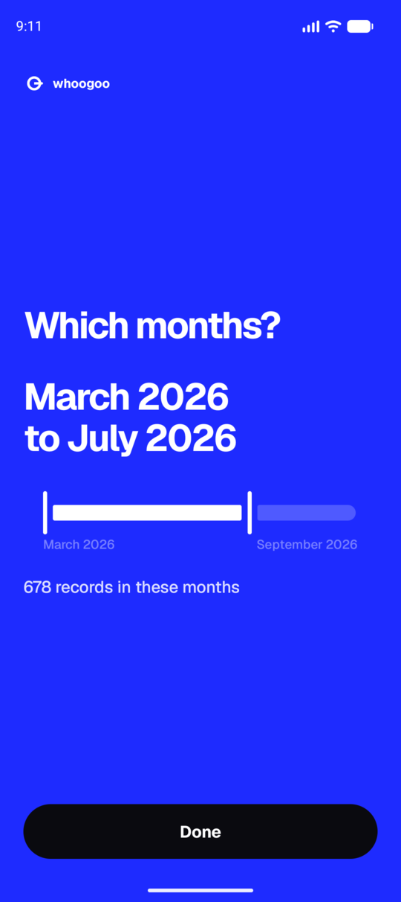

<div align="center">

<picture>
  <source media="(prefers-color-scheme: dark)" srcset="docs/assets/logo-dark.png">
  
</picture>

[](https://github.com/joaodrp/whoogoo/actions/workflows/ci.yml)
[](https://github.com/joaodrp/whoogoo/releases/latest)
[](LICENSE)

Import your WHOOP history into Google Health.

</div>

## How it works

Give the app the export zip WHOOP emails you and it writes your history into Health Connect, from
where the Google Health app carries it into your account: Google Health has no file import, and its
API cannot write the daily vitals. Without an Android phone, the `whoogoo` command line tool runs
the app on an emulator and checks afterwards that everything arrived.

A one-time migration, not a sync. It moves what is in the export and stops, and nothing keeps
watching your WHOOP account. Run it again with a newer export and it updates what it already wrote.

<p align="center">
  
  
  
</p>

## Coverage

Anything whoogoo cannot carry across truthfully is left out. A wrong number in your health history
is worse than a missing one.

| WHOOP | | Google Health | Note |
|---|:-:|---|---|
| Resting heart rate | ✅ | Resting heart rate | measured during sleep, stamped at wake time |
| Heart rate variability | ✅ | HRV | WHOOP's HRV is RMSSD, which is what Health Connect stores |
| Blood oxygen | ✅ | Oxygen saturation | a night average, not a spot reading |
| Respiratory rate | ✅ | Respiratory rate | a night average, not a spot reading |
| Workouts | ✅ | Exercise session | time and type only, no heart rate or route; the activity name becomes the title |
| Sleep | ❌ | | the export gives each stage's length but never when it happened. Inventing the timeline fabricates the shape of your night; leaving the stages out makes Google Health read the whole session as asleep and record your awake time as zero |
| Skin temperature | ❌ | | Health Connect stores a baseline plus a nightly delta, and Google Health discards ours to recompute the variation from its own. Early nights then display as an absolute temperature, around "+33.9 C" |
| Calories, daily and per workout | ❌ | | devices estimate calories too differently to mix in one history, and WHOOP's per-workout figure includes the resting energy burned during it |
| Recovery, strain, sleep scores, heart rate zones, max and average heart rate, journal entries | ❌ | | no matching type in Health Connect |
| VO2 max | ❌ | | not in the export at all |

## Do it in slices

A few years of WHOOP is a few thousand records, and the slowest part is not the import but Google
Health copying it afterwards. Start with a month, look at it in Google Health, then widen. The app
has a date range on the choosing screen and the command line has `--from` and `--until`.

Nothing is lost by going slowly, and nothing is duplicated by overlapping slices: each record
carries an identifier derived from its WHOOP timestamp, so importing the same days again updates
what is there.

Both paths below start the same way: request your export in the WHOOP app (More -> App settings ->
Data export) and wait for the email.

## On an Android phone

1. Download `whoogoo_<version>.apk` from the
   [latest release](https://github.com/joaodrp/whoogoo/releases/latest) and open it to install
   (Android asks you to allow installs from your browser or Files app).
2. Open Whoogoo, choose the export zip and allow the Health Connect permissions it asks for. The
   app lists what the export holds and how many records of each kind. It takes everything by
   default; untick what you would rather leave behind, and drag the two handles under "Change" to
   import only part of the history.
3. Follow [Sync to your Google account](#sync-to-your-google-account) below, in Google Health on
   the phone.

## Without a phone: the emulator

The `whoogoo` command line tool sets up an Android emulator and runs the app on it.

### Prerequisites

- Android SDK command-line tools. `whoogoo setup` installs everything else (emulator,
  platform-tools, the Android 17 Play Store image, about 2 GB) and, on macOS with Homebrew, offers to
  install the command-line tools themselves. Elsewhere get them from
  [Android Studio](https://developer.android.com/studio) or the
  [command-line tools](https://developer.android.com/studio#command-line-tools-only) download, with
  `ANDROID_HOME` set. Google's SDK tools need a JDK; `setup` offers `mise use -g java@21` if mise
  is present.
- Linux: access to `/dev/kvm`. macOS: nothing extra.
- A Google account already set up with Google Health

### Install

whoogoo is a single static binary for Linux and macOS (x86_64 and arm64).

```sh
mise use -g github:joaodrp/whoogoo
```

or download the archive for your platform from the
[latest release](https://github.com/joaodrp/whoogoo/releases/latest) and put `whoogoo` on your `PATH`.

### Steps

```sh
whoogoo setup                           # checks the SDK, offers to install what is missing, creates the device
whoogoo emu                             # boots the Pixel 10 / Android 17 emulator; leave it running
whoogoo import my_whoop_data.zip        # in another terminal: installs the app, hands it the export, shows progress
```

`import` takes the whole export by default. `--skip` leaves record types out and `--from` and
`--until` limit the dates, which is how you stop where another device took over:

```sh
whoogoo import --skip exercise --until 2026-05-31 my_whoop_data.zip
```

`whoogoo doctor` is the read-only version of `setup`, and `setup -y` runs the fixes without asking.
Every command has `--help`; `whoogoo completion <shell>` prints shell completions.

If the emulator window is sluggish and its log says "Your GPU drivers may have a bug", the
emulator has fallen back to software rendering. `whoogoo emu --gpu host` uses the real GPU, which
works on most Linux machines despite the warning.

`import` prints progress and ends with `done`. Health Connect on the emulator now holds your data:
search for "Health Connect" in the emulator's Settings and open Data and access.

## Sync to your Google account

On the phone, or in the emulator window:

1. On the emulator: open the Play Store, sign in with your Google account and install Google Health.
   If your account uses passkeys for 2-step verification, choose "Try another way": the emulator has
   no Bluetooth, so it cannot use a passkey on your phone. A backup code or an authenticator app
   works.
2. Open Google Health and sign in.
3. In Google Health: Connections -> Health Connect (or Partner apps -> Set up Health Connect). Allow
   all data types, then under Additional access enable Historical data and background access.
4. That is the whole setup. Syncing starts on its own; see Timing below.

Menu names follow Google's help pages and may differ slightly between app versions.

### Timing

An import writes to Health Connect and finishes. Your account catches up afterwards, on Google
Health's own schedule.

- **It takes a while.** Not seconds, and not on a schedule you control. Start it and come back
  later.
- **Google Health has to be set up first**, as above. Without it an import goes no further than
  Health Connect.
- **It does not need to be in the foreground.** Copying has run with it in the background, and with
  another app on screen. Opening it does no harm if you want to check progress.
- **Interrupting is safe.** A part-finished sync carries on later, and records already copied are
  not copied twice.
- **On the emulator, only the first sign-in needs a window.** Once the account is set up,
  `whoogoo emu --headless` handles the sync and stays out of your way.

A night's numbers appear on the date you woke up, because that is when WHOOP files them.

Google Health computes Cardio Load and its other scores from first-party devices only, so imported
history feeds the charts and trends without producing scores.

## Check it arrived

`whoogoo verify` reads your account through the Google Health API and diffs it against what the
last `whoogoo import` loaded, per type: matched, value differs, missing. One-time setup:

1. [Create a Google Cloud project](https://console.cloud.google.com/projectcreate), then
   [enable the Google Health API](https://console.cloud.google.com/apis/library/health.googleapis.com)
   in it.
2. [OAuth consent screen](https://console.cloud.google.com/auth/overview): External, publishing
   status Testing, add your Google account under Audience -> Test users. No verification is needed
   for personal use.
3. [Credentials](https://console.cloud.google.com/apis/credentials) -> Create OAuth client ID ->
   Desktop app. Export the values:

   ```sh
   export GOOGLE_HEALTH_CLIENT_ID=...
   export GOOGLE_HEALTH_CLIENT_SECRET=...
   ```

The first run opens a browser for consent (read-only scopes) and prints where it cached the token.

One limit worth knowing: Google stores the vitals as one value per day, so it compares a day with
both a nap and a night sleep against their average and reports a difference, even though both
records are correct.

Records written by other apps are counted separately, under "other", and never as a match for
yours.

## Overlap with other apps

Health Connect keeps one copy per app, so a day another app already wrote is stored twice, once
from that app and once from whoogoo. Google Health then shows only one of them, the copy it already
had, and whoogoo's stays hidden. Days and workouts nothing else recorded show up normally.

The choosing screen has a "leave out what I have" option that looks for the overlap and skips it. It
asks for read access when you tap it, and not before: whoogoo writes to Health Connect and does not
read it unless you ask for this. A day another app already filled counts as a duplicate; a workout
counts when it overlaps one already there.

It only sees this device's Health Connect. Data that reached your Google account another way, such
as a phone syncing WHOOP through Apple Health, is invisible to it. For that, either untick the
types or pass `--until` with the day before your other device took over.

## Privacy

The released APK is a debug build, because the command line needs that to talk to the app on an
emulator. Installing it on a real phone has one consequence worth knowing: anyone who can reach
that phone over adb can read the app's own files, which briefly include the export you imported.
The app deletes them once it has read them, and nothing is kept afterwards.

## Start over

In Health Connect: App permissions -> Whoogoo -> See app data, then the delete icon, tick the
types and delete. That removes what whoogoo wrote and nothing else. On the emulator you can instead
delete the virtual device and run `whoogoo emu` again.

Data that has already synced to your Google account is a separate copy, and deleting in Health
Connect removes it only for workouts.

Those deletions travel the same way an import does, so the same applies: Google Health has to be
set up, and it takes a while. Nothing appears to happen until it does, so leave it alone rather
than deleting again.

The daily vitals do not travel at all. They stay in the account long after Health Connect has let
them go, and the Google Health API cannot delete them either: it can create and remove workouts,
sleep and body measurements, but the daily vitals are read-only. The one route that works is
Google Health itself, under profile -> Your data in Google Health -> Deletion options, per data
type and date range. That takes effect straight away, and it deletes every source for those dates
rather than only whoogoo's, so pick the range with care.

## Contributing

Build instructions, the repository layout and the release process are in
[CONTRIBUTING.md](CONTRIBUTING.md).
